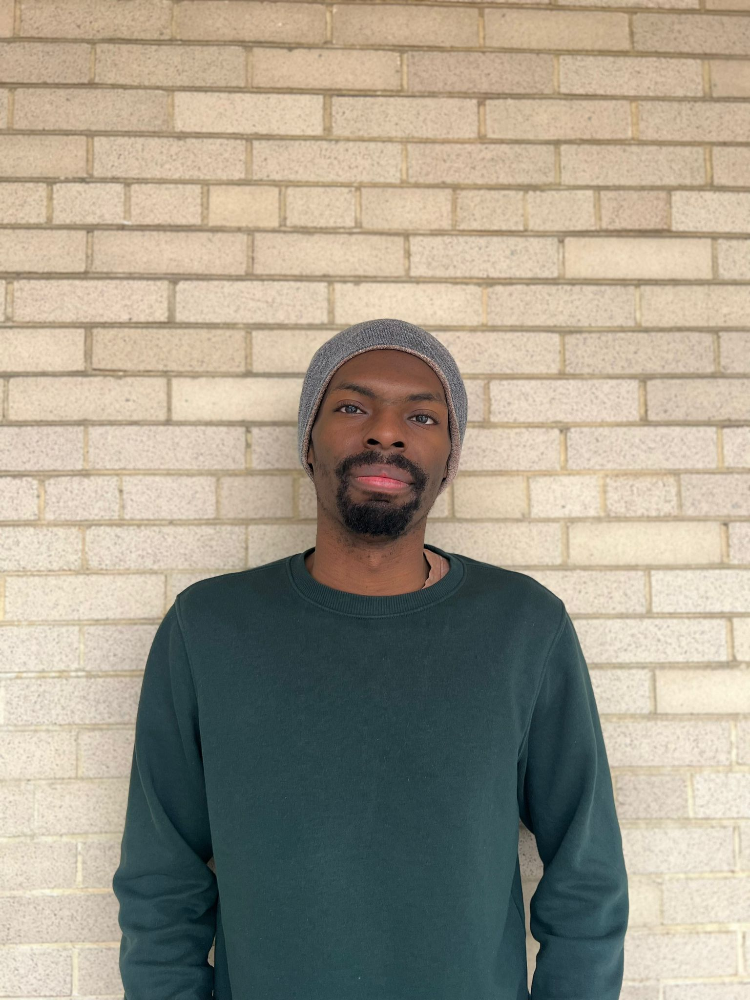

I'm the [Rappaport Fellow](https://hls.harvard.edu/academics/fellowships-and-prizes/fellowships/rappaport-fellowship/current-rappaport-fellow/) and Lecturer on Law at Harvard Law School, where I taught "Language and the Law: Beyond the Canons." My research focuses on the implications language and linguistics have for the legal system and rigorous analysis of legal linguistic policy. For example, my student note in the [_Harvard Law Review_](https://harvardlawreview.org/print/vol-136/dialectal-due-process/) argued that failures in the judicial system to account for dialectal differences in English (like Black English or Appalachian English) are cognizable as due process issues. And my project [_Black English for Lawyers: A Primer_](https://papers.ssrn.com/sol3/papers.cfm?abstract_id=4556233) is forthcoming in the _California Law Review_. 

Aside from my research, I help represent asylum seekers. I also do policy work in the law and neuroscience space with the [Center for Law, Brain & Behavior](https://clbb.mgh.harvard.edu/) in conjunction with Mass General Hospital as a Fellow in Law and Applied Neuroscience.

I love teaching, having taught high school Spanish in Atlanta where I grew up and always having a blast learning with the folks at [Harlem Clemente](https://harlemclemente.org/). In college at Columbia University, I studied Political Science, Economics, and Linguistics, focusing on the relationship between the [Ainu](https://en.unesco.org/courier/numero-especial-octubre-2009/saga-ainu-language) language and Japanese. Unsurprisingly, I'm a language nerd (my current fixation is ʻŌlelo Hawaiʻi!).

